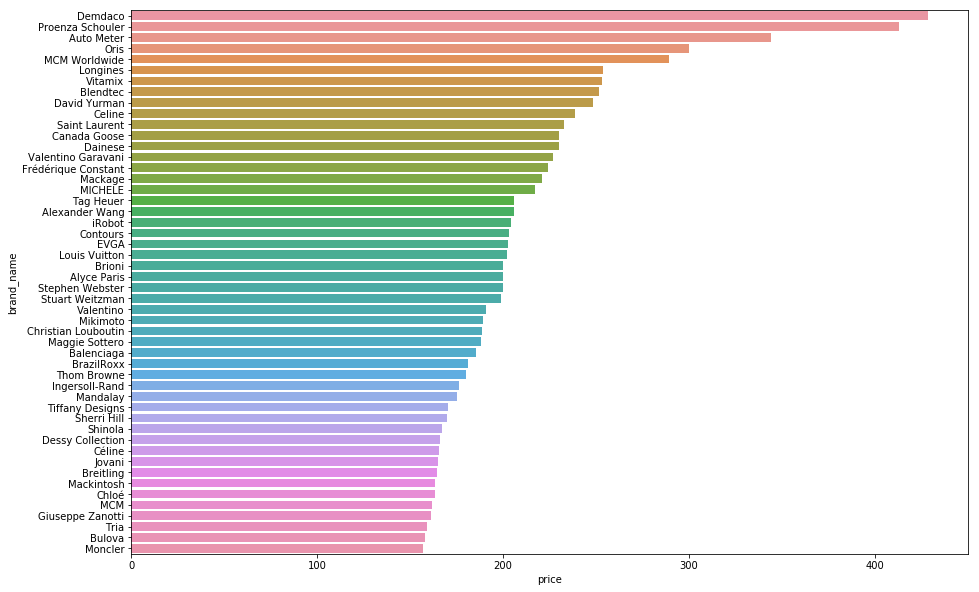
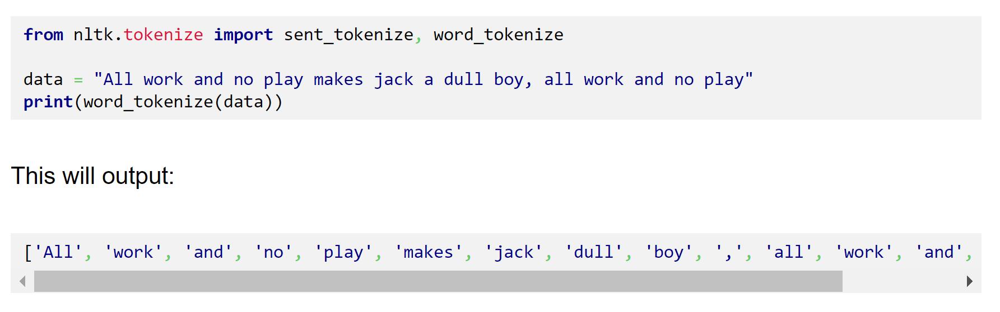
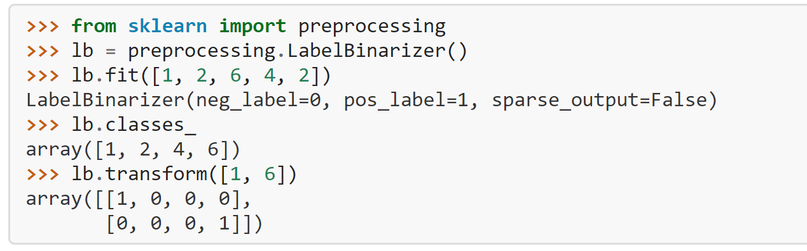

## Mercari Price Suggestion Challenge
**Can you automatically suggest product prices to online sellers?**

**It can be hard to know how much something’s really worth**. Small details can mean big differences in pricing. 


<br>
<br>

## Objective

To predict the sales price of a listing based on the information provided by the user for that listing.


## Flowchart


## Parameters given by User to predict:

1. **Id** : Id of the product
2. **Name**: title of the product
3. **Condition**: condition of the product (0: bad, 5: new)
4. **Category_name**: Category which product belongs to
5. **Brand_name**: Brand which product belongs to
6. **Shipping**: who (buyer/seller) will buy shipping charges
7. **Description**: product description in more detail

## Target 
**Price**: Value of that product

## General Report

**How to classify the problem**: Since we need to predict the prices, so its a Supervised Machine Learning, we'll use different ML algorithms to get the good result.

**How to measure the performance of the problem**: In creation of supervised ML model, we'll use RMSE (Root mean square error).

**What other things can affect the model**: Parameters like Geographical location, time, economic conditions can help in predicting the prices more better.

## Importing Libraries


```python
import pandas as pd
import seaborn as sns
import numpy as np
import matplotlib.pyplot as plt
pd.set_option('display.float_format', lambda x: '%.3f' % x)
import warnings
warnings.filterwarnings('ignore')
```


```python
train_data = pd.read_csv('data/train.tsv', delimiter= '\t')
train_data.head()
```


<div>
<style scoped>
    .dataframe tbody tr th:only-of-type {
        vertical-align: middle;
    }

    .dataframe tbody tr th {
        vertical-align: top;
    }

    .dataframe thead th {
        text-align: right;
    }
</style>
<table border="1" class="dataframe">
  <thead>
    <tr style="text-align: right;">
      <th></th>
      <th>train_id</th>
      <th>name</th>
      <th>item_condition_id</th>
      <th>category_name</th>
      <th>brand_name</th>
      <th>price</th>
      <th>shipping</th>
      <th>item_description</th>
    </tr>
  </thead>
  <tbody>
    <tr>
      <th>0</th>
      <td>0</td>
      <td>MLB Cincinnati Reds T Shirt Size XL</td>
      <td>3</td>
      <td>Men/Tops/T-shirts</td>
      <td>NaN</td>
      <td>10.000</td>
      <td>1</td>
      <td>No description yet</td>
    </tr>
    <tr>
      <th>1</th>
      <td>1</td>
      <td>Razer BlackWidow Chroma Keyboard</td>
      <td>3</td>
      <td>Electronics/Computers &amp; Tablets/Components &amp; P...</td>
      <td>Razer</td>
      <td>52.000</td>
      <td>0</td>
      <td>This keyboard is in great condition and works ...</td>
    </tr>
    <tr>
      <th>2</th>
      <td>2</td>
      <td>AVA-VIV Blouse</td>
      <td>1</td>
      <td>Women/Tops &amp; Blouses/Blouse</td>
      <td>Target</td>
      <td>10.000</td>
      <td>1</td>
      <td>Adorable top with a hint of lace and a key hol...</td>
    </tr>
    <tr>
      <th>3</th>
      <td>3</td>
      <td>Leather Horse Statues</td>
      <td>1</td>
      <td>Home/Home Décor/Home Décor Accents</td>
      <td>NaN</td>
      <td>35.000</td>
      <td>1</td>
      <td>New with tags. Leather horses. Retail for [rm]...</td>
    </tr>
    <tr>
      <th>4</th>
      <td>4</td>
      <td>24K GOLD plated rose</td>
      <td>1</td>
      <td>Women/Jewelry/Necklaces</td>
      <td>NaN</td>
      <td>44.000</td>
      <td>0</td>
      <td>Complete with certificate of authenticity</td>
    </tr>
  </tbody>
</table>
</div>


```python
test_data_1 = pd.read_csv('data/test.tsv', delimiter= '\t')
test_data_1.head()
```


<div>
<style scoped>
    .dataframe tbody tr th:only-of-type {
        vertical-align: middle;
    }

    .dataframe tbody tr th {
        vertical-align: top;
    }

    .dataframe thead th {
        text-align: right;
    }
</style>
<table border="1" class="dataframe">
  <thead>
    <tr style="text-align: right;">
      <th></th>
      <th>test_id</th>
      <th>name</th>
      <th>item_condition_id</th>
      <th>category_name</th>
      <th>brand_name</th>
      <th>shipping</th>
      <th>item_description</th>
    </tr>
  </thead>
  <tbody>
    <tr>
      <th>0</th>
      <td>0</td>
      <td>Breast cancer "I fight like a girl" ring</td>
      <td>1</td>
      <td>Women/Jewelry/Rings</td>
      <td>NaN</td>
      <td>1</td>
      <td>Size 7</td>
    </tr>
    <tr>
      <th>1</th>
      <td>1</td>
      <td>25 pcs NEW 7.5"x12" Kraft Bubble Mailers</td>
      <td>1</td>
      <td>Other/Office supplies/Shipping Supplies</td>
      <td>NaN</td>
      <td>1</td>
      <td>25 pcs NEW 7.5"x12" Kraft Bubble Mailers Lined...</td>
    </tr>
    <tr>
      <th>2</th>
      <td>2</td>
      <td>Coach bag</td>
      <td>1</td>
      <td>Vintage &amp; Collectibles/Bags and Purses/Handbag</td>
      <td>Coach</td>
      <td>1</td>
      <td>Brand new coach bag. Bought for [rm] at a Coac...</td>
    </tr>
    <tr>
      <th>3</th>
      <td>3</td>
      <td>Floral Kimono</td>
      <td>2</td>
      <td>Women/Sweaters/Cardigan</td>
      <td>NaN</td>
      <td>0</td>
      <td>-floral kimono -never worn -lightweight and pe...</td>
    </tr>
    <tr>
      <th>4</th>
      <td>4</td>
      <td>Life after Death</td>
      <td>3</td>
      <td>Other/Books/Religion &amp; Spirituality</td>
      <td>NaN</td>
      <td>1</td>
      <td>Rediscovering life after the loss of a loved o...</td>
    </tr>
  </tbody>
</table>
</div>


Here, in both datasets we can see some **NaN values** which we need to remove

## Exploratory Data Analysis

### Price Distribution

By Analysing Price, we found:

* **Mean**: 26 USD
* **Median**: 17 USD
* **Std**: 38 USD
* **Max price**: 2009 USD
* **Min price**: 0 USD (doesn't make any sense)
* Price distribution is **right skewed** due to this we can see the difference between Mean and Standard deviation.
* Buyer will pay more if he pays for shipping.


```python
train_data.price.describe()
```


    count   1482535.000
    mean         26.738
    std          38.586
    min           0.000
    25%          10.000
    50%          17.000
    75%          29.000
    max        2009.000
    Name: price, dtype: float64


```python
def plot_histogram(column, range_size, color, bins, title, xlabel, ylabel):
    plt.subplots(figsize=(15,5))
    plt.hist(train_data[(train_data[column] > range_size[0]) & (train_data[column] < range_size[1])]['price'], bins=bins, 
             color= color, edgecolor = 'black')
    plt.title(title)
    plt.xlabel(xlabel)
    plt.ylabel(ylabel)
```


```python
plot_histogram('price', (0,300), 'blue', 50, 'Price Distribution', 'Price', 'Counts')
```


```python
ax = sns.countplot(x="shipping", data=train_data)
```


By seeing the countplot of shipping we can say proporation of **Seller paying for shipping is little higher**.


```python
def plot_shipping():
    plt.subplots(figsize=(15,5))
    plt.hist(train_data[train_data['shipping'] ==1]['price'], bins=50, color= 'green', edgecolor = 'black', 
             range=[0,300], normed=True, label = 'seller is paying for shipping', alpha = 0.5)
    plt.hist(train_data[train_data['shipping'] ==0]['price'], bins=50, color= 'orange', edgecolor = 'black', 
             range=[0,300], normed=True, label = 'buyer is paying for shipping', alpha = 0.5)
    plt.title('Price Distribution With/Without Shipping', fontsize=15)
    plt.xlabel('Price')
    plt.ylabel('Normalized Samples')
    plt.legend()
```


```python
plot_shipping()
```


```python
train_data[train_data['shipping'] == 1]['price'].median()
```


    14.0


```python
train_data[train_data['shipping'] == 0]['price'].median()
```


    20.0


As we imagined that if **buyer pays for shipping then selling price will be high**

### Brand Analysis


```python
train_data['brand_name'].value_counts().reset_index()
```


<div>
<style scoped>
    .dataframe tbody tr th:only-of-type {
        vertical-align: middle;
    }

    .dataframe tbody tr th {
        vertical-align: top;
    }

    .dataframe thead th {
        text-align: right;
    }
</style>
<table border="1" class="dataframe">
  <thead>
    <tr style="text-align: right;">
      <th></th>
      <th>index</th>
      <th>brand_name</th>
    </tr>
  </thead>
  <tbody>
    <tr>
      <th>0</th>
      <td>PINK</td>
      <td>54088</td>
    </tr>
    <tr>
      <th>1</th>
      <td>Nike</td>
      <td>54043</td>
    </tr>
    <tr>
      <th>2</th>
      <td>Victoria's Secret</td>
      <td>48036</td>
    </tr>
    <tr>
      <th>3</th>
      <td>LuLaRoe</td>
      <td>31024</td>
    </tr>
    <tr>
      <th>4</th>
      <td>Apple</td>
      <td>17322</td>
    </tr>
    <tr>
      <th>5</th>
      <td>FOREVER 21</td>
      <td>15186</td>
    </tr>
    <tr>
      <th>6</th>
      <td>Nintendo</td>
      <td>15007</td>
    </tr>
    <tr>
      <th>7</th>
      <td>Lululemon</td>
      <td>14558</td>
    </tr>
    <tr>
      <th>8</th>
      <td>Michael Kors</td>
      <td>13928</td>
    </tr>
    <tr>
      <th>9</th>
      <td>American Eagle</td>
      <td>13254</td>
    </tr>
    <tr>
      <th>10</th>
      <td>Rae Dunn</td>
      <td>12305</td>
    </tr>
    <tr>
      <th>11</th>
      <td>Sephora</td>
      <td>12172</td>
    </tr>
    <tr>
      <th>12</th>
      <td>Coach</td>
      <td>10463</td>
    </tr>
    <tr>
      <th>13</th>
      <td>Disney</td>
      <td>10360</td>
    </tr>
    <tr>
      <th>14</th>
      <td>Bath &amp; Body Works</td>
      <td>10354</td>
    </tr>
    <tr>
      <th>15</th>
      <td>Adidas</td>
      <td>10202</td>
    </tr>
    <tr>
      <th>16</th>
      <td>Funko</td>
      <td>9237</td>
    </tr>
    <tr>
      <th>17</th>
      <td>Under Armour</td>
      <td>8461</td>
    </tr>
    <tr>
      <th>18</th>
      <td>Sony</td>
      <td>7994</td>
    </tr>
    <tr>
      <th>19</th>
      <td>Old Navy</td>
      <td>7567</td>
    </tr>
    <tr>
      <th>20</th>
      <td>Hollister</td>
      <td>6948</td>
    </tr>
    <tr>
      <th>21</th>
      <td>Carter's</td>
      <td>6385</td>
    </tr>
    <tr>
      <th>22</th>
      <td>Urban Decay</td>
      <td>6210</td>
    </tr>
    <tr>
      <th>23</th>
      <td>The North Face</td>
      <td>6172</td>
    </tr>
    <tr>
      <th>24</th>
      <td>Independent</td>
      <td>5902</td>
    </tr>
    <tr>
      <th>25</th>
      <td>Too Faced</td>
      <td>5794</td>
    </tr>
    <tr>
      <th>26</th>
      <td>Xbox</td>
      <td>5709</td>
    </tr>
    <tr>
      <th>27</th>
      <td>Brandy Melville</td>
      <td>5680</td>
    </tr>
    <tr>
      <th>28</th>
      <td>Kate Spade</td>
      <td>5411</td>
    </tr>
    <tr>
      <th>29</th>
      <td>MAC</td>
      <td>5302</td>
    </tr>
    <tr>
      <th>...</th>
      <td>...</td>
      <td>...</td>
    </tr>
    <tr>
      <th>4779</th>
      <td>Palm Grove</td>
      <td>1</td>
    </tr>
    <tr>
      <th>4780</th>
      <td>TIGLIO</td>
      <td>1</td>
    </tr>
    <tr>
      <th>4781</th>
      <td>John Blair</td>
      <td>1</td>
    </tr>
    <tr>
      <th>4782</th>
      <td>Polycom</td>
      <td>1</td>
    </tr>
    <tr>
      <th>4783</th>
      <td>Xelement</td>
      <td>1</td>
    </tr>
    <tr>
      <th>4784</th>
      <td>Acne Studios</td>
      <td>1</td>
    </tr>
    <tr>
      <th>4785</th>
      <td>Maya</td>
      <td>1</td>
    </tr>
    <tr>
      <th>4786</th>
      <td>TRU-SPEC</td>
      <td>1</td>
    </tr>
    <tr>
      <th>4787</th>
      <td>Dragon</td>
      <td>1</td>
    </tr>
    <tr>
      <th>4788</th>
      <td>Anna Kostrova</td>
      <td>1</td>
    </tr>
    <tr>
      <th>4789</th>
      <td>West Coast Choppers</td>
      <td>1</td>
    </tr>
    <tr>
      <th>4790</th>
      <td>Fairway</td>
      <td>1</td>
    </tr>
    <tr>
      <th>4791</th>
      <td>Curvy Couture</td>
      <td>1</td>
    </tr>
    <tr>
      <th>4792</th>
      <td>Matt Bernson</td>
      <td>1</td>
    </tr>
    <tr>
      <th>4793</th>
      <td>DDF</td>
      <td>1</td>
    </tr>
    <tr>
      <th>4794</th>
      <td>Chicago</td>
      <td>1</td>
    </tr>
    <tr>
      <th>4795</th>
      <td>Rocky Brands, Inc.</td>
      <td>1</td>
    </tr>
    <tr>
      <th>4796</th>
      <td>Hyland's</td>
      <td>1</td>
    </tr>
    <tr>
      <th>4797</th>
      <td>Greenleaf Dollhouses</td>
      <td>1</td>
    </tr>
    <tr>
      <th>4798</th>
      <td>Bepuzzled</td>
      <td>1</td>
    </tr>
    <tr>
      <th>4799</th>
      <td>Fascinations</td>
      <td>1</td>
    </tr>
    <tr>
      <th>4800</th>
      <td>Lolly Wolly Doodle</td>
      <td>1</td>
    </tr>
    <tr>
      <th>4801</th>
      <td>Nutri-Vet</td>
      <td>1</td>
    </tr>
    <tr>
      <th>4802</th>
      <td>Alien Workshop</td>
      <td>1</td>
    </tr>
    <tr>
      <th>4803</th>
      <td>Lela Rose</td>
      <td>1</td>
    </tr>
    <tr>
      <th>4804</th>
      <td>Shane Company</td>
      <td>1</td>
    </tr>
    <tr>
      <th>4805</th>
      <td>Casual Corner Annex</td>
      <td>1</td>
    </tr>
    <tr>
      <th>4806</th>
      <td>The Learning Journey</td>
      <td>1</td>
    </tr>
    <tr>
      <th>4807</th>
      <td>CharmLeaks</td>
      <td>1</td>
    </tr>
    <tr>
      <th>4808</th>
      <td>Valco Baby</td>
      <td>1</td>
    </tr>
  </tbody>
</table>
<p>4809 rows × 2 columns</p>
</div>


Since we have close to **5000 brand names** , lets checkout **top 50 brands**


```python
plt.subplots(figsize=(15,10))
ax = sns.barplot(x = 'brand_name', y = 'index', data = train_data['brand_name'].value_counts().reset_index()[:50])
ax.set(xlabel='count', ylabel='brand_name')
```


    [Text(0, 0.5, 'brand_name'), Text(0.5, 0, 'count')]


```python
brand_mean = train_data.groupby(['brand_name'])['price'].mean()
plt.subplots(figsize=(15,10))
sns.barplot(x = 'price', y = 'brand_name', data = brand_mean.reset_index().sort_values(by = 'price', 
                                                                                       ascending = False)[:50])
```


    <matplotlib.axes._subplots.AxesSubplot at 0x7f7df9df3ba8>





### Category Analysis

If we see our data then we'll find that in our category_name **we have three categories segregated by '/'** so lets split them into **three categories named 'main_category', 'sub_category', 'product_category'**.


```python
def create_sub_categories(dataframe):
    dataframe['temp'] = dataframe['category_name'].apply(lambda x: str(x).split('/'))
    main_category = []
    sub_category = []
    sub_category2 = []
    for i in dataframe['temp'].values:
        main_category.append(i[0])
        try:
            sub_category.append(i[1])
        except:
            sub_category.append(np.nan)
        try:
            sub_category2.append(i[2])
        except:
            sub_category2.append(np.nan)
    dataframe['main_category'] = main_category
    dataframe['sub_category'] =sub_category
    dataframe['sub_category2']= sub_category2
    dataframe = dataframe.drop(columns='temp')
    return dataframe
```


```python
category_df = train_data[['category_name', 'price']]
category_df = create_sub_categories(category_df)
category_df.head()
```


<div>
<style scoped>
    .dataframe tbody tr th:only-of-type {
        vertical-align: middle;
    }

    .dataframe tbody tr th {
        vertical-align: top;
    }

    .dataframe thead th {
        text-align: right;
    }
</style>
<table border="1" class="dataframe">
  <thead>
    <tr style="text-align: right;">
      <th></th>
      <th>category_name</th>
      <th>price</th>
      <th>main_category</th>
      <th>sub_category</th>
      <th>sub_category2</th>
    </tr>
  </thead>
  <tbody>
    <tr>
      <th>0</th>
      <td>Men/Tops/T-shirts</td>
      <td>10.000</td>
      <td>Men</td>
      <td>Tops</td>
      <td>T-shirts</td>
    </tr>
    <tr>
      <th>1</th>
      <td>Electronics/Computers &amp; Tablets/Components &amp; P...</td>
      <td>52.000</td>
      <td>Electronics</td>
      <td>Computers &amp; Tablets</td>
      <td>Components &amp; Parts</td>
    </tr>
    <tr>
      <th>2</th>
      <td>Women/Tops &amp; Blouses/Blouse</td>
      <td>10.000</td>
      <td>Women</td>
      <td>Tops &amp; Blouses</td>
      <td>Blouse</td>
    </tr>
    <tr>
      <th>3</th>
      <td>Home/Home Décor/Home Décor Accents</td>
      <td>35.000</td>
      <td>Home</td>
      <td>Home Décor</td>
      <td>Home Décor Accents</td>
    </tr>
    <tr>
      <th>4</th>
      <td>Women/Jewelry/Necklaces</td>
      <td>44.000</td>
      <td>Women</td>
      <td>Jewelry</td>
      <td>Necklaces</td>
    </tr>
  </tbody>
</table>
</div>


#### Major contributer main category in the distribution 


```python
f, ax = plt.subplots(figsize=(10, 5))
sns.countplot(y="main_category", data=category_df, color="c")
```


    <matplotlib.axes._subplots.AxesSubplot at 0x7f7dd354f4e0>


#### Top 25 Major contributer at sub_category in the distribution¶


```python
f, ax = plt.subplots(figsize=(20, 7))
sns.set(style="darkgrid")
sns.countplot(x="sub_category", data=category_df, color="blue", 
              order=category_df.sub_category.value_counts().iloc[:25].index)
plt.xticks(rotation=90)
```


    (array([ 0,  1,  2,  3,  4,  5,  6,  7,  8,  9, 10, 11, 12, 13, 14, 15, 16,
            17, 18, 19, 20, 21, 22, 23, 24]),
     <a list of 25 Text xticklabel objects>)


#### Top 25 Major contributer at sub_category2 in the distribution¶


```python
f, ax = plt.subplots(figsize=(20, 7))
sns.countplot(x="sub_category2", data=category_df, color="red", 
              order=category_df.sub_category2.value_counts().iloc[:25].index)
plt.xticks(rotation=90)
```


    (array([ 0,  1,  2,  3,  4,  5,  6,  7,  8,  9, 10, 11, 12, 13, 14, 15, 16,
            17, 18, 19, 20, 21, 22, 23, 24]),
     <a list of 25 Text xticklabel objects>)


### Item Description Analysis
We need to know how item description depends on the price, if the length of description starts increasing then price starts falling down or start increasing

**Result:** We determined that Price of an item will get stagnant as length of item_description increases. So it means price depends on the content of the description.


```python
item_descrip_analysis = train_data[['item_description', 'price']]
item_descrip_analysis['length'] = item_descrip_analysis['item_description'].apply(lambda x: len(str(x)))
```


```python
item_descrip_analysis.head()
```


<div>
<style scoped>
    .dataframe tbody tr th:only-of-type {
        vertical-align: middle;
    }

    .dataframe tbody tr th {
        vertical-align: top;
    }

    .dataframe thead th {
        text-align: right;
    }
</style>
<table border="1" class="dataframe">
  <thead>
    <tr style="text-align: right;">
      <th></th>
      <th>item_description</th>
      <th>price</th>
      <th>length</th>
    </tr>
  </thead>
  <tbody>
    <tr>
      <th>0</th>
      <td>No description yet</td>
      <td>10.000</td>
      <td>18</td>
    </tr>
    <tr>
      <th>1</th>
      <td>This keyboard is in great condition and works ...</td>
      <td>52.000</td>
      <td>188</td>
    </tr>
    <tr>
      <th>2</th>
      <td>Adorable top with a hint of lace and a key hol...</td>
      <td>10.000</td>
      <td>124</td>
    </tr>
    <tr>
      <th>3</th>
      <td>New with tags. Leather horses. Retail for [rm]...</td>
      <td>35.000</td>
      <td>173</td>
    </tr>
    <tr>
      <th>4</th>
      <td>Complete with certificate of authenticity</td>
      <td>44.000</td>
      <td>41</td>
    </tr>
  </tbody>
</table>
</div>


```python
f, ax = plt.subplots(figsize=(20, 5))
sns.pointplot(x = item_descrip_analysis['length'].values, y = item_descrip_analysis['price'].values, 
              color='green')
```


    <matplotlib.axes._subplots.AxesSubplot at 0x7f7def59fe48>


# Natural Language Processing for item_description

Here in NLP we are using nltk to do the following:
1. Removing stop words
2. Removing puntuations
3. Removing stem words
4. Converting the description to lower letters
5. Removing all the digits

### Removing all the puntuations and special characters from the description.


```python
import string
def removal_puntuations(x):
    x =  ' '.join(word.strip(string.punctuation) for word in x.split())
    return x
```

### Removing stop words (is, are, the) which are unrelevant for our analysis

**Stopwords from nltk** downloads the list of all the words which are frequently used in the text which doesn't reveal any meaning in the sentence


```python
from nltk.corpus import stopwords
try:
    stop = stopwords.words('english')
except:
    nltk.download('stopwords')
    stop = stopwords.words('english')

def removal_stop_words(x):
    x =  ' '.join([word for word in x.split() if word not in (stop)])
    return x
```

### Removing all the digits 


```python
digits = '0123456789'
def removal_digits(x):
    x =  ''.join([i for i in x if not i.isdigit()])
    return x
```

### Convert the description to lower letters


```python
def lowercase(x):
    return x.lower()
```

### Removing stem words (converting all the words into their root form)

1. **PorterStemmer**: Convert all the words into its root form, eg: working becomes work, saw becomes see.




```python
from nltk.stem import PorterStemmer
from nltk.tokenize import sent_tokenize, word_tokenize
import nltk
nltk.download('punkt')
  
ps = PorterStemmer()
def removal_stem_words(x):
    x = ' '.join(ps.stem(word) for word in x.split())
    return x
```

    [nltk_data] Downloading package punkt to /root/nltk_data...
    [nltk_data]   Package punkt is already up-to-date!
    

## Preprocessing the Data

To do so we need to combine both test and train data and run all the feature scaling functions


```python
new_combined = train_data.append(test_data_1)
new_combined.head()
```


<div>
<style scoped>
    .dataframe tbody tr th:only-of-type {
        vertical-align: middle;
    }

    .dataframe tbody tr th {
        vertical-align: top;
    }

    .dataframe thead th {
        text-align: right;
    }
</style>
<table border="1" class="dataframe">
  <thead>
    <tr style="text-align: right;">
      <th></th>
      <th>brand_name</th>
      <th>category_name</th>
      <th>item_condition_id</th>
      <th>item_description</th>
      <th>name</th>
      <th>price</th>
      <th>shipping</th>
      <th>test_id</th>
      <th>train_id</th>
    </tr>
  </thead>
  <tbody>
    <tr>
      <th>0</th>
      <td>NaN</td>
      <td>Men/Tops/T-shirts</td>
      <td>3</td>
      <td>No description yet</td>
      <td>MLB Cincinnati Reds T Shirt Size XL</td>
      <td>10.000</td>
      <td>1</td>
      <td>nan</td>
      <td>0.000</td>
    </tr>
    <tr>
      <th>1</th>
      <td>Razer</td>
      <td>Electronics/Computers &amp; Tablets/Components &amp; P...</td>
      <td>3</td>
      <td>This keyboard is in great condition and works ...</td>
      <td>Razer BlackWidow Chroma Keyboard</td>
      <td>52.000</td>
      <td>0</td>
      <td>nan</td>
      <td>1.000</td>
    </tr>
    <tr>
      <th>2</th>
      <td>Target</td>
      <td>Women/Tops &amp; Blouses/Blouse</td>
      <td>1</td>
      <td>Adorable top with a hint of lace and a key hol...</td>
      <td>AVA-VIV Blouse</td>
      <td>10.000</td>
      <td>1</td>
      <td>nan</td>
      <td>2.000</td>
    </tr>
    <tr>
      <th>3</th>
      <td>NaN</td>
      <td>Home/Home Décor/Home Décor Accents</td>
      <td>1</td>
      <td>New with tags. Leather horses. Retail for [rm]...</td>
      <td>Leather Horse Statues</td>
      <td>35.000</td>
      <td>1</td>
      <td>nan</td>
      <td>3.000</td>
    </tr>
    <tr>
      <th>4</th>
      <td>NaN</td>
      <td>Women/Jewelry/Necklaces</td>
      <td>1</td>
      <td>Complete with certificate of authenticity</td>
      <td>24K GOLD plated rose</td>
      <td>44.000</td>
      <td>0</td>
      <td>nan</td>
      <td>4.000</td>
    </tr>
  </tbody>
</table>
</div>


### Size of train and test data


```python
print('train_data:',train_data.shape[0])
print('test_data:',test_data_1.shape[0])
print('total_combined_data:', new_combined.shape[0])
```

    train_data: 1482535
    test_data: 693359
    total_combined_data: 2175894
    


```python
new_combined['item_description'] = new_combined['item_description'].astype(str)
new_combined['name'] = new_combined['name'].astype(str)

new_combined['item_description'] = new_combined['item_description'].apply(removal_puntuations)
new_combined['item_description'] = new_combined['item_description'].apply(removal_digits)
new_combined['item_description'] = new_combined['item_description'].apply(removal_stop_words)
new_combined['item_description'] = new_combined['item_description'].apply(lowercase)
new_combined['item_description'] = new_combined['item_description'].apply(removal_stem_words)

new_combined['name'] = new_combined['name'].apply(removal_puntuations)
new_combined['name'] = new_combined['name'].apply(removal_digits)
new_combined['name'] = new_combined['name'].apply(removal_stop_words)
new_combined['name'] = new_combined['name'].apply(lowercase)
new_combined['name'] = new_combined['name'].apply(removal_stem_words)
```


```python
new_combined.head()
```


<div>
<style scoped>
    .dataframe tbody tr th:only-of-type {
        vertical-align: middle;
    }

    .dataframe tbody tr th {
        vertical-align: top;
    }

    .dataframe thead th {
        text-align: right;
    }
</style>
<table border="1" class="dataframe">
  <thead>
    <tr style="text-align: right;">
      <th></th>
      <th>brand_name</th>
      <th>category_name</th>
      <th>item_condition_id</th>
      <th>item_description</th>
      <th>name</th>
      <th>price</th>
      <th>shipping</th>
      <th>test_id</th>
      <th>train_id</th>
    </tr>
  </thead>
  <tbody>
    <tr>
      <th>0</th>
      <td>NaN</td>
      <td>Men/Tops/T-shirts</td>
      <td>3</td>
      <td>no descript yet</td>
      <td>mlb cincinnati red t shirt size xl</td>
      <td>10.000</td>
      <td>1</td>
      <td>nan</td>
      <td>0.000</td>
    </tr>
    <tr>
      <th>1</th>
      <td>Razer</td>
      <td>Electronics/Computers &amp; Tablets/Components &amp; P...</td>
      <td>3</td>
      <td>thi keyboard great condit work like came box a...</td>
      <td>razer blackwidow chroma keyboard</td>
      <td>52.000</td>
      <td>0</td>
      <td>nan</td>
      <td>1.000</td>
    </tr>
    <tr>
      <th>2</th>
      <td>Target</td>
      <td>Women/Tops &amp; Blouses/Blouse</td>
      <td>1</td>
      <td>ador top hint lace key hole back the pale pink...</td>
      <td>ava-viv blous</td>
      <td>10.000</td>
      <td>1</td>
      <td>nan</td>
      <td>2.000</td>
    </tr>
    <tr>
      <th>3</th>
      <td>NaN</td>
      <td>Home/Home Décor/Home Décor Accents</td>
      <td>1</td>
      <td>new tag leather hors retail rm stand foot high...</td>
      <td>leather hors statu</td>
      <td>35.000</td>
      <td>1</td>
      <td>nan</td>
      <td>3.000</td>
    </tr>
    <tr>
      <th>4</th>
      <td>NaN</td>
      <td>Women/Jewelry/Necklaces</td>
      <td>1</td>
      <td>complet certif authent</td>
      <td>k gold plate rose</td>
      <td>44.000</td>
      <td>0</td>
      <td>nan</td>
      <td>4.000</td>
    </tr>
  </tbody>
</table>
</div>


```python
new_combined = create_sub_categories(new_combined)
```


```python
new_combined.to_csv('data/final_dataset.csv', index=False) #saving the data to save future compute
```


```python
new_combined.head()
```


<div>
<style scoped>
    .dataframe tbody tr th:only-of-type {
        vertical-align: middle;
    }

    .dataframe tbody tr th {
        vertical-align: top;
    }

    .dataframe thead th {
        text-align: right;
    }
</style>
<table border="1" class="dataframe">
  <thead>
    <tr style="text-align: right;">
      <th></th>
      <th>brand_name</th>
      <th>category_name</th>
      <th>item_condition_id</th>
      <th>item_description</th>
      <th>name</th>
      <th>price</th>
      <th>shipping</th>
      <th>test_id</th>
      <th>train_id</th>
      <th>main_category</th>
      <th>sub_category</th>
      <th>sub_category2</th>
    </tr>
  </thead>
  <tbody>
    <tr>
      <th>0</th>
      <td>NaN</td>
      <td>Men/Tops/T-shirts</td>
      <td>3</td>
      <td>no descript yet</td>
      <td>mlb cincinnati red t shirt size xl</td>
      <td>10.000</td>
      <td>1</td>
      <td>nan</td>
      <td>0.000</td>
      <td>Men</td>
      <td>Tops</td>
      <td>T-shirts</td>
    </tr>
    <tr>
      <th>1</th>
      <td>Razer</td>
      <td>Electronics/Computers &amp; Tablets/Components &amp; P...</td>
      <td>3</td>
      <td>thi keyboard great condit work like came box a...</td>
      <td>razer blackwidow chroma keyboard</td>
      <td>52.000</td>
      <td>0</td>
      <td>nan</td>
      <td>1.000</td>
      <td>Electronics</td>
      <td>Computers &amp; Tablets</td>
      <td>Components &amp; Parts</td>
    </tr>
    <tr>
      <th>2</th>
      <td>Target</td>
      <td>Women/Tops &amp; Blouses/Blouse</td>
      <td>1</td>
      <td>ador top hint lace key hole back the pale pink...</td>
      <td>ava-viv blous</td>
      <td>10.000</td>
      <td>1</td>
      <td>nan</td>
      <td>2.000</td>
      <td>Women</td>
      <td>Tops &amp; Blouses</td>
      <td>Blouse</td>
    </tr>
    <tr>
      <th>3</th>
      <td>NaN</td>
      <td>Home/Home Décor/Home Décor Accents</td>
      <td>1</td>
      <td>new tag leather hors retail rm stand foot high...</td>
      <td>leather hors statu</td>
      <td>35.000</td>
      <td>1</td>
      <td>nan</td>
      <td>3.000</td>
      <td>Home</td>
      <td>Home Décor</td>
      <td>Home Décor Accents</td>
    </tr>
    <tr>
      <th>4</th>
      <td>NaN</td>
      <td>Women/Jewelry/Necklaces</td>
      <td>1</td>
      <td>complet certif authent</td>
      <td>k gold plate rose</td>
      <td>44.000</td>
      <td>0</td>
      <td>nan</td>
      <td>4.000</td>
      <td>Women</td>
      <td>Jewelry</td>
      <td>Necklaces</td>
    </tr>
  </tbody>
</table>
</div>


### We still found that brand_name, and some category have nan values, so need to replace them with some other characters to have the general model


```python
new_combined.isna().sum()
```


    brand_name            928207
    category_name           9385
    item_condition_id          0
    item_description           0
    name                       0
    price                 693359
    shipping                   0
    test_id              1482535
    train_id              693359
    main_category              0
    sub_category            9385
    sub_category2           9385
    dtype: int64


```python
missing_values = {'brand_name': 'missing', 'sub_category':'None', 'sub_category2':'None'}
new_combined = new_combined.fillna(value=missing_values)
new_combined.head()
```


<div>
<style scoped>
    .dataframe tbody tr th:only-of-type {
        vertical-align: middle;
    }

    .dataframe tbody tr th {
        vertical-align: top;
    }

    .dataframe thead th {
        text-align: right;
    }
</style>
<table border="1" class="dataframe">
  <thead>
    <tr style="text-align: right;">
      <th></th>
      <th>brand_name</th>
      <th>category_name</th>
      <th>item_condition_id</th>
      <th>item_description</th>
      <th>name</th>
      <th>price</th>
      <th>shipping</th>
      <th>test_id</th>
      <th>train_id</th>
      <th>main_category</th>
      <th>sub_category</th>
      <th>sub_category2</th>
    </tr>
  </thead>
  <tbody>
    <tr>
      <th>0</th>
      <td>missing</td>
      <td>Men/Tops/T-shirts</td>
      <td>3</td>
      <td>no descript yet</td>
      <td>mlb cincinnati red t shirt size xl</td>
      <td>10.000</td>
      <td>1</td>
      <td>nan</td>
      <td>0.000</td>
      <td>Men</td>
      <td>Tops</td>
      <td>T-shirts</td>
    </tr>
    <tr>
      <th>1</th>
      <td>Razer</td>
      <td>Electronics/Computers &amp; Tablets/Components &amp; P...</td>
      <td>3</td>
      <td>thi keyboard great condit work like came box a...</td>
      <td>razer blackwidow chroma keyboard</td>
      <td>52.000</td>
      <td>0</td>
      <td>nan</td>
      <td>1.000</td>
      <td>Electronics</td>
      <td>Computers &amp; Tablets</td>
      <td>Components &amp; Parts</td>
    </tr>
    <tr>
      <th>2</th>
      <td>Target</td>
      <td>Women/Tops &amp; Blouses/Blouse</td>
      <td>1</td>
      <td>ador top hint lace key hole back the pale pink...</td>
      <td>ava-viv blous</td>
      <td>10.000</td>
      <td>1</td>
      <td>nan</td>
      <td>2.000</td>
      <td>Women</td>
      <td>Tops &amp; Blouses</td>
      <td>Blouse</td>
    </tr>
    <tr>
      <th>3</th>
      <td>missing</td>
      <td>Home/Home Décor/Home Décor Accents</td>
      <td>1</td>
      <td>new tag leather hors retail rm stand foot high...</td>
      <td>leather hors statu</td>
      <td>35.000</td>
      <td>1</td>
      <td>nan</td>
      <td>3.000</td>
      <td>Home</td>
      <td>Home Décor</td>
      <td>Home Décor Accents</td>
    </tr>
    <tr>
      <th>4</th>
      <td>missing</td>
      <td>Women/Jewelry/Necklaces</td>
      <td>1</td>
      <td>complet certif authent</td>
      <td>k gold plate rose</td>
      <td>44.000</td>
      <td>0</td>
      <td>nan</td>
      <td>4.000</td>
      <td>Women</td>
      <td>Jewelry</td>
      <td>Necklaces</td>
    </tr>
  </tbody>
</table>
</div>


```python
new_combined.isna().sum()
```


    brand_name                 0
    category_name           9385
    item_condition_id          0
    item_description           0
    name                       0
    price                 693359
    shipping                   0
    test_id              1482535
    train_id              693359
    main_category              0
    sub_category               0
    sub_category2              0
    dtype: int64


## Converting all the categorical or string based columns into sparse matrix to train the model.

To do so we are using diffrent types of encoder:
1. CountVectorizer: will apply it on 'name' column which will give sparse matrix of the occurence of all the words.


2. TfidfVectorizer: will apply it on 'item_description' column which will also give the sparse matrix of the occurence but in normalized form

TF-IDF stands for “Term Frequency — Inverse Data Frequency”. First, we will learn what this term means mathematically.

Term Frequency (tf): gives us the frequency of the word in each document in the corpus. It is the ratio of number of times the word appears in a document compared to the total number of words in that document. It increases as the number of occurrences of that word within the document increases. Each document has its own tf.


Inverse Data Frequency (idf): used to calculate the weight of rare words across all documents in the corpus. The words that occur rarely in the corpus have a high IDF score. It is given by the equation below.


Combining these two we come up with the TF-IDF score (w) for a word in a document in the corpus. It is the product of tf and idf:


3. LabelBinarizer: will apply it on 'brand_name' column as its a categorical variable so it will create a 2D matrix with shape (number_of_rows, number_of_unique_brands)




```python
from sklearn.feature_extraction.text import CountVectorizer
cv = CountVectorizer(max_df = 10)
name_mat = cv.fit_transform(new_combined['name'])
```


```python
cv = CountVectorizer()
main_mat = cv.fit_transform(new_combined['main_category'])
```


```python
cv = CountVectorizer()
sub_mat = cv.fit_transform(new_combined['sub_category'])
```


```python
cv = CountVectorizer()
sub2_mat = cv.fit_transform(new_combined['sub_category2'])
```


```python
from sklearn.feature_extraction.text import TfidfVectorizer
tfidf = TfidfVectorizer(max_features = 60000, ngram_range = (1,3), stop_words = 'english')
descrip_mat = tfidf.fit_transform(new_combined['item_description'])
```


```python
from sklearn.preprocessing import LabelBinarizer
onehotencoder = LabelBinarizer(sparse_output=True)
brand_mat = onehotencoder.fit_transform(new_combined['brand_name'])
```


```python
item_shipping_mat = pd.get_dummies(new_combined[['item_condition_id', 'shipping']], sparse = True).values
```

### Now we have all the matrix, we need to combine them to make the proper dataset to train/test the model

- Since item_shipping_mat is numpy array, we need to convert it to csr_matrix
- will use hstack to combine all the sparse matrix into one


```python
from scipy import sparse
item_shipping_mat_csr = sparse.csr_matrix(item_shipping_mat)
```


```python
type(item_shipping_mat_csr)
```


    scipy.sparse.csr.csr_matrix


```python
train_test_dataset = sparse.hstack([brand_mat, main_mat, sub_mat, sub2_mat, name_mat, descrip_mat, 
                                    item_shipping_mat]).tocsr()
```


```python
train_test_dataset.shape
```


    (2175894, 151721)


### Here we can see that number of features from 8 has been increased to 151721


```python
import scipy.sparse
scipy.sparse.save_npz('data/sparse_matrix.npz', train_test_dataset)
```


```python
import scipy.sparse
train_test_dataset = scipy.sparse.load_npz('data/sparse_matrix.npz')
```


```python
train_test_dataset.shape
```


    (2175894, 151721)


# Machine Learning

## Splitting into train and test datasets


```python
xtrain = train_test_dataset[:1482535]
ytrain = train_data['price'].values
xtest = train_test_dataset[1482535:]
```


```python
xtrain.shape, ytrain.shape
```


    ((1482535, 151721), (1482535,))


```python
ytrain
```


    array([2.30258509, 3.95124372, 2.30258509, ..., 2.48490665, 3.80666249,
           3.09104245])


## Exploring different Machine Learning Algorithm and using cross_validation to calculate the highest accuracy

## Ridge Regression


```python
from sklearn.linear_model import Ridge
from sklearn.model_selection import train_test_split
import math
X_train, X_test, y_train, y_test = train_test_split(xtrain, ytrain, test_size = 0.1)
now = time.time()
model_ridge = Ridge(solver = 'sag', fit_intercept = False)
model_ridge.fit(X_train, y_train)
y_pred_ridge = model_ridge.predict(X_test)
rms = math.sqrt(mean_squared_error(y_test, y_pred_ridge))
print('Loss:',rms)
print('Time Taken:',time.time() - now)
```

    Loss: 30.298763749438383
    Time Taken: 110.44774222373962
    


```python
y_test[:50]
```


    array([315.,  36.,  24.,  16.,  23.,  12.,  18.,  15.,  23.,  14., 143.,
            34.,   7.,  27.,  26.,  13.,   6.,  51.,  18.,  15.,  25.,  30.,
            17.,  10.,  21.,  30.,  10.,  19.,  17.,  16.,  16.,  31.,  24.,
            46.,   3.,   5., 100.,   7.,  20.,  35.,  34.,  35.,  50.,   8.,
            18.,   8.,  15.,  20.,  16.,  70.])


```python
y_pred_ridge[:50]
```


    array([232.6587539 ,  31.0714124 ,  29.75845072,  19.4865851 ,
            26.3316417 ,   7.82036554,  11.62702811,  17.56351441,
            24.89793811,  37.45927037,  88.98717705,  17.84674427,
            20.27993499,  51.60605937,  25.48078299,  22.58179237,
             6.61034001,  35.32447831,  20.45735885,  59.8191297 ,
            21.25931733,  40.5468098 ,  22.2522782 ,  -0.39874764,
            48.18855254,  21.51743743,  23.38997729,  26.25282817,
            27.88447366,  15.53454433,  32.82200916,  22.99390969,
            30.79071527,  58.81903172,   5.16667625,  17.61888814,
           175.34692522,   5.35996102,  26.88352358,  30.95118787,
            38.06725967,  30.73621634,  62.89770776,   1.16534781,
            12.04954617,  16.15281855,  18.67367234,  36.54183008,
            28.97822776,  67.22669586])


## LightGBM

**What is Light GBM?**

Light GBM is a gradient boosting framework that uses tree based learning algorithm.

**How it differs from other tree based algorithm?**

Light GBM grows tree vertically while other algorithm grows trees horizontally meaning that Light GBM grows tree leaf-wise while other algorithm grows level-wise. It will choose the leaf with max delta loss to grow. When growing the same leaf, Leaf-wise algorithm can reduce more loss than a level-wise algorithm.


**Can we use Light GBM everywhere?**

No, it is not advisable to use LGBM on small datasets. Light GBM is sensitive to overfitting and can easily overfit small data. Their is no threshold on the number of rows but my experience suggests me to use it only for data with 10,000+ rows.


```python
from sklearn.model_selection import train_test_split
import math
import lightgbm as lgb
X_train, X_test, y_train, y_test = train_test_split(xtrain, ytrain, test_size = 0.1)
y_train_log = np.log1p(y_train)
d_train = lgb.Dataset(X_train, label=y_train_log)
params = {}
#params['learning_rate'] = 0.003
params['boosting_type'] = 'gbdt'
params['objective'] = 'regression'
params['metric'] = 'rmse'
now = time.time()
clf = lgb.train(params, d_train, 100, init_model=clf, learning_rates=lambda iter: 0.03 * (0.99 ** iter))
y_pred_lgbm = clf.predict(X_test)
y_pred_lgbm = np.expm1(y_pred_lgbm)
rms = math.sqrt(mean_squared_error(y_test, y_pred_lgbm))
print('Loss:',rms)
print('Time Taken:',time.time() - now)
```

    Loss: 31.51026504298643
    Time Taken: 58.74648308753967
    


```python
y_test[50:100]
```


    array([14.,  6., 10., 35., 12.,  5., 99., 72., 10., 19., 17., 10., 10.,
           18., 10., 31., 99.,  8., 14., 32., 11., 55., 15.,  9., 44., 45.,
           10., 66.,  8.,  8., 13., 81., 30., 66., 35., 10., 19.,  9., 17.,
           24., 23.,  7., 26.,  6., 49.,  7., 36., 13., 10., 46.])


```python
y_pred_lgbm[50:100]
```


    array([17.93182019, 10.73253913, 14.27699573, 26.62021822, 16.08758775,
            7.92255667, 76.85706483, 10.49487018, 23.24514625, 38.13832393,
           16.31088539, 12.40411681, 18.29843816, 28.37307876, 15.8483662 ,
           17.23817511, 29.4953987 ,  9.35596566, 14.37706721, 16.78085653,
           10.16628405, 53.51804507, 11.98203358, 13.1134069 , 16.72868105,
           31.16552991,  8.42827103, 25.41423044, 11.34092439,  9.78896938,
           16.75840428, 80.04214498, 18.10891713, 16.29362178, 19.86775722,
           10.9047366 , 16.23948458, 15.55872494,  9.18932246, 30.27915431,
           13.1313908 , 15.22269664, 19.04828059, 10.1331885 , 23.2083595 ,
           13.83273614, 42.73367535, 13.51425196, 14.7786328 , 26.13148768])


## Linear Regression


```python
from sklearn.linear_model import LinearRegression
from sklearn.model_selection import train_test_split
import math
X_train, X_test, y_train, y_test = train_test_split(xtrain, ytrain, test_size = 0.1)
now = time.time()
model_linear = LinearRegression()
model_linear.fit(X_train, y_train)
y_pred_linear = model_linear.predict(X_test)
rms = math.sqrt(mean_squared_error(y_test, y_pred_ridge))
print('Loss:',rms)
print('Time Taken:',time.time() - now)
```

    Loss: 46.30636796049923
    Time Taken: 7176.847347021103
    


```python
y_test[:50]
```


    array([21.,  5., 12., 21., 14., 16., 10.,  9., 37., 31., 24., 32., 10.,
            6., 13., 10., 15., 31., 11., 36., 35.,  7., 44., 34., 31., 12.,
           52., 19., 23., 12., 15.,  9., 31.,  9., 14., 10., 16.,  8., 32.,
           44., 16., 19., 10., 12., 46.,  9., 12., 34., 21., 29.])


```python
y_pred_linear[:50]
```


    array([ 7.01803739, 15.56346527, 10.84872434, 29.61798262, 27.47554461,
            9.57060376, 12.21932197, 30.22936295, 31.0421079 , 26.65148664,
           35.6802469 ,  9.53200528, 16.98914429, 14.48090532,  8.47320936,
           34.65597867, 21.88367344, 35.3726478 , 49.35279535, 57.76140394,
           16.01787172, 15.12712851, 21.83406351, 57.06498325, 44.66909547,
            8.27665374, 36.68862659, 16.12689859,  9.41132291, 28.41325334,
            5.28938456, 23.63999416, 36.96726195, 28.48632391,  9.60231043,
           22.58611311, 13.33549873, 24.07777268, 23.62884335, 72.51144442,
           16.41319451, 35.88303143, 13.69224772, 21.90576305, 32.05742581,
           39.94113229,  5.57275239,  1.74859387, 13.06295464, 14.06080132])


## Random Forest


```python
from sklearn.ensemble import RandomForestRegressor
from sklearn.model_selection import train_test_split
import math,time
X_train, X_test, y_train, y_test = train_test_split(xtrain, ytrain, test_size = 0.1)
now = time.time()
model_rd = RandomForestRegressor()
model_rd.fit(X_train, y_train)
y_pred_rd = model_linear.predict(X_test)
rms = math.sqrt(mean_squared_error(y_test, y_pred_rd))
print('Loss:',rms)
print('Time Taken:',time.time() - now)
```


```python
y_test[:50]
```


```python
y_pred_rd[:50]
```

# References

1. https://medium.freecodecamp.org/how-to-process-textual-data-using-tf-idf-in-python-cd2bbc0a94a3
2. https://scikit-learn.org/stable/modules/generated/sklearn.preprocessing.LabelBinarizer.html
3. https://scikit-learn.org/stable/modules/generated/sklearn.feature_extraction.text.CountVectorizer.html
4. https://medium.com/@pushkarmandot/https-medium-com-pushkarmandot-what-is-lightgbm-how-to-implement-it-how-to-fine-tune-the-parameters-60347819b7fc
5. Hands-On Machine Learning with Scikit-Learn and TensorFlow by Aurélien Géron

## Thank you
